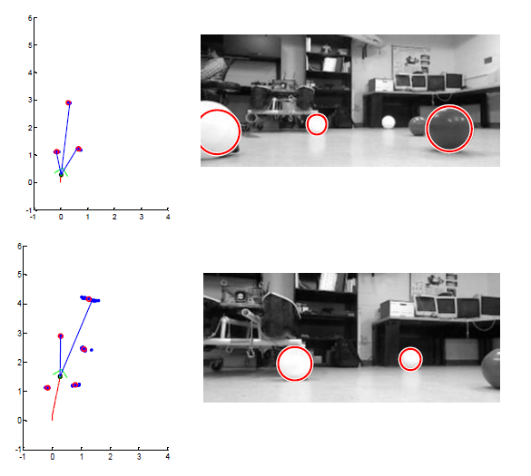

#fastSLAM
========

fastSLAM is a particle filter based SLAM implementation.This code is implemented in MATLAB and is a modification to the scripts written by Randolph Voorhies.  The modification is to use unknown data association as well as multiple measurements at a single timestep. Additionally, this was ported to work on real robot data.

In the SimpleSLAM-master directory, there is a simulation with fake data as well as a sub-directory with real robot data.

  

#Path Planner

An A* path planner written to avoid obstacles.  This is done with simulated data and is available in two flavors. One knowing all the obstacles before hand as well as an implementation that moves the simulated robot and sees new obstacles.

Here is a sample output of the dynamic Path Planner

  

